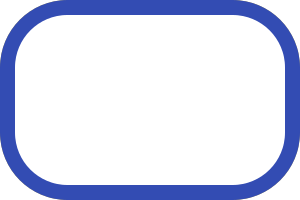
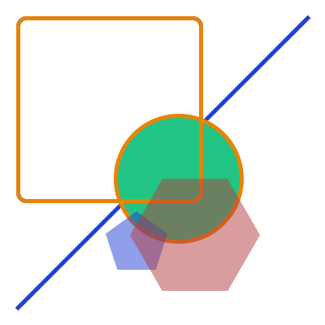
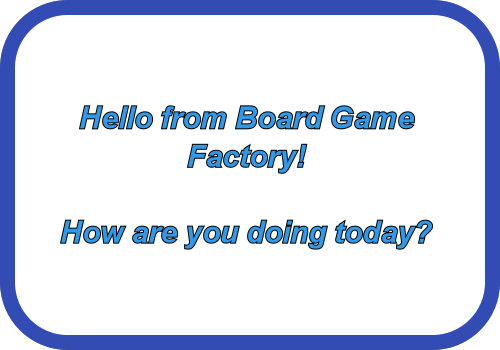
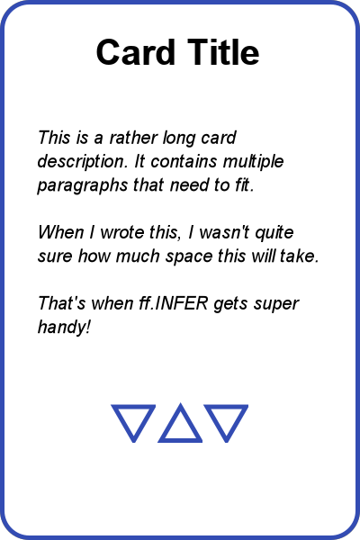
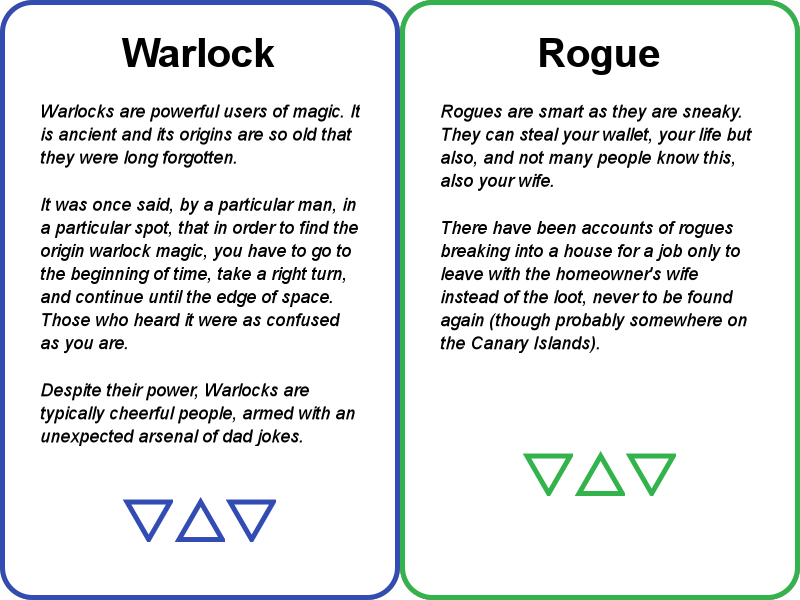
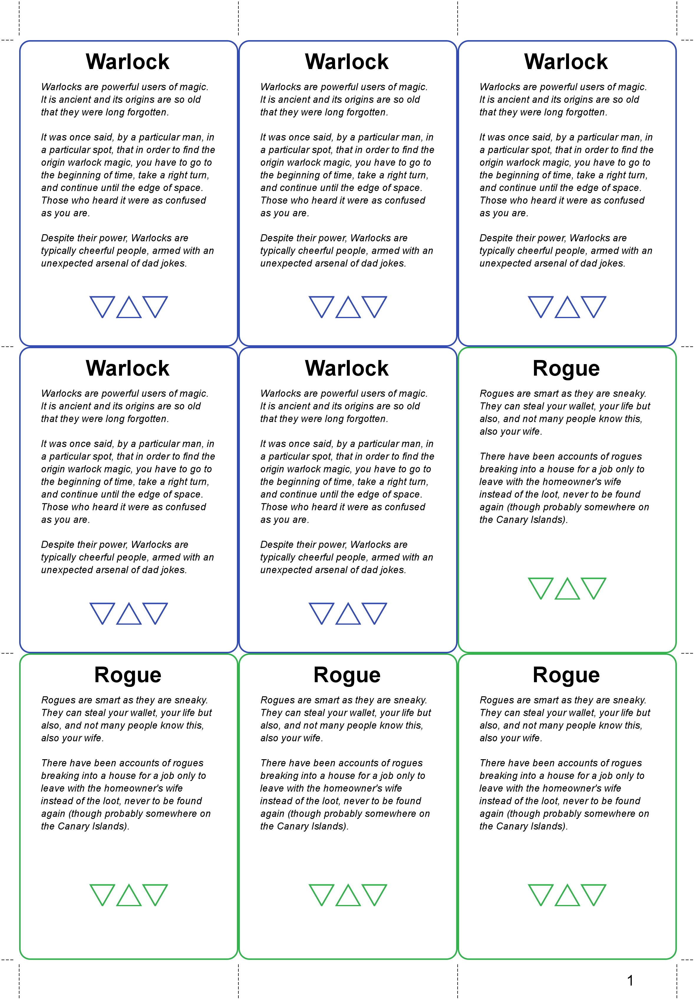

# Board Game Factory

#### Contributors are welcome here! :) See the last section of this Readme

This is a tool for rapid creation of paper prototypes of your cards, tiles,
tokens and sheets.

Here are samples of what I've made with Board Game Factory:
https://imgur.com/a/TS779gR

I've developed it personally to satisfy my need for a solid prototyping
engine for board games (couldn't find anything that did what I wanted, so I
made it myself). It can be used just as a simple rendering library for python,
to make whatever you want.

It uses vector graphics for rendering (cairo & pango libraries on the backend).

**DISCLAIMER:** The framework is still under development, it is quite feature
complete,
I used it to make and print thousands of cards and other board game assets
already,
but from QoL perspective, there are many things that could be improved. So
before we
reach version 1.0, expect updates to possibly present breaking changes. We will
keep it to absolute minimum and do it with consideration, but we want to keep
this freedom. So
always update
with caution, preferably creating a separate venv.

## Installation

### 1. Get Pango & Cairo

Pango & Cairo are the only prerequisites that cannot be installed with `pip`.

#### Windows

Install
this: https://github.com/tschoonj/GTK-for-Windows-Runtime-Environment-Installer

pango and cairo are included in this GTK+ for Windows Installer, all you need is
to install this on your system. (you can find alternatives too, if you look)

#### Linux

pango and cairo are most likely installed on your system already (they're at the
heart of GTK). You might need is to install `python-dev` and `libffi-dev` using
your OS's package manager.

(This was not tested, I'm referencing cairocffi and pangocffi docs, let me know
if it's inaccurate or doesn't work)

#### MacOS

```commandline
brew install pkg-config
brew install libffi
brew install pango
brew install glib
```

### 2. Install Board Game Factory

````commandline
pip install board-game-factory
````

### Having any issues?

`bgfactory` has the same prerequisites as `cairocffi` and `pangocffi`.

Take a look at documentation of pangocffi and cairocffi packages (these are the
python bindings into the binaries). Their installation instructions should work:

https://cairocffi.readthedocs.io/en/stable/overview.html#installing-cairocffi
https://pangocffi.readthedocs.io/en/latest/overview.html

If none of that works for you, create an Issue, describe your issues and all
that you've tried, and I can take a look at it.

# Getting Started

The following examples are the best documentation to date, contain a lot of
extra context. They also showcase many of the features and how to use them
together. So if you want to use this framework for yourself, read carefully
and use this as a reference.

all code presented below can be found in [examples/](examples/). They
purposefully don't contain a lot of code to be bite-sized and digestable.

## 01 - The Basics

[examples/01_basics.py](examples/01_basics.py)

Let's draw our first thing.

```python
from bgfactory import ff

component = ff.RoundedRectangle(0, 0, 300, 200, radius=60, stroke_width=15,
                                stroke_src=(0.2, 0.3, 0.7),
                                fill_src=ff.COLOR_WHITE)

component.image().show()

component.image().save('image.png')
```

The code above creates a rounded rectangle component, shows it on screen and
saves it to a png.

You should see this:



All drawing in the framework is done using components.

They represent everything elementary that's going to be drawn:

- a line or a rectangle
- piece of text
- ...

All components take `x, y` coordinates as their first arguments. What follows
is always definition of dimensions where suitable, `w, h` for most components
but e.g. circle is defined with `x, y, radius` instead of `x, y, w, h`.

The unit here is pixels. Even though on the backend vector graphics is used
with infinite resolution, you still need to ground the coordinate system in
something and pixels here are the most natural since they then correspond 1:1
with the dimensions of rendered images.

Every component extends `ff.Component` which also in turn allows to
use `.image()`
on every component. It returns a PIL.Image, which you
can easily manipulate further, most often with show or save.

This is very convenient, you have instant visual debugging for everything, even
your own components.

## 02 - Containers & Shapes

[examples/02_containers_and_shapes.py](examples/02_containers_and_shapes.py)

In order to make more complicated components you need some place to put them
together into and that's what containers are for.

Containers allow components to have descendants (we call them children here)
that render inside them.

Unlike for the `Component` base class, you will find yourself using the base
`Container` quite often, since it represents a rectangle container that has
no fill or border.

We use it here to showcase all the shapes and put them together in one picture.
In the beginning we add a white square to the middle for better visibility
no matter your background.

```python
from bgfactory import ff

# colors can be 3-tuple or 4-tuple of values between 0 and 1
COLOR1 = (232 / 255, 131 / 255, 7 / 255)
COLOR2 = (33 / 255, 196 / 255, 131 / 255)
COLOR3 = (32 / 255, 65 / 255, 212 / 255)
COLOR4_SEMITRANSPARENT = (32 / 255, 65 / 255, 212 / 255, 128 / 255)
COLOR5_SEMITRANSPARENT = (180 / 255, 60 / 255, 64 / 255, 128 / 255)

# for shapes: stroke = border, fill = inside
container = ff.Container(
    0, 0, 400, 400,
    children=[
        ff.Rectangle(50, 50, 350, 350, fill_src=ff.COLOR_WHITE, stroke_width=0),
        ff.Line(20, 380, 380, 20, stroke_width=5, stroke_src=COLOR3),
        ff.Circle(140, 140, 80, stroke_width=5, stroke_src=COLOR1,
                  fill_src=COLOR2),
        ff.RoundedRectangle(20, 20, 230, 230, stroke_width=5, stroke_src=COLOR1,
                            fill_src=ff.COLOR_TRANSPARENT),
    ]
)
container.add(
    ff.RegularPolygon(130, 260, 40, 5, fill_src=COLOR4_SEMITRANSPARENT,
                      stroke_width=0),
    ff.RegularPolygon(160, 220, 80, 6, fill_src=COLOR5_SEMITRANSPARENT,
                      stroke_width=0)
)

container.image().show()
```

Couple of things to note:

- notice 2 ways of adding components to a container, you can use either or both.
- all shapes extend `Container`, not `Component`, so you can easily put shapes
  into other shapes.
- note the way the colors are defined, they have to be a 3-tuple or a 4-tuple of
  floats between 0 and 1. The 4th channel represents transparency
    - there is a good reason why the arguments are called stroke_src, fill_src
      and not
      stroke_color, fill_color. That's because the arguments are way more
      flexible, imagine source
      as being an image and the area to be filled simply a mask on this image.
      For
      a fixed color this corresponds to a filled rectangle, so you get the same
      color everywhere. But you can for example also use any color gradient (
      composed of arbitrary many colors) or even any image.
    - So most of the time, src=color, but sometimes it allows you to do crazy
      stuff
- notice that the order in which components are added they are also rendered
- `Container` cannot have any stroke or fill. If you need them, simply
  use `Rectangle` instead, they are equivalent in every other way.

And finally, what you should see:



## 03 - Uniform Text and Alignment

Now let's see how do you render text. cairo is used for text rendering too,
however to get the render path, pango is used. General-purpose text rendering
is an incredibly complex problem with the amount of writing systems worldwide.
Since pango is at the core rendering engine of many Linux distributions,
pango can handle everything, any font, any locale, any writing system.

(In other words if some feature you would want is missing, write a feature
request, please :)

For text rendering, there are 2 components available at the moment:
`TextUniform` and `TextMarkup`. Their crucial difference is that `TextUniform`
imposes the same style on the whole text that's being rendered, whereas
`TextMarkup` allows you to mark the text with html tags to modify the style and
beyond that it has a feature of inlaying any Component directly into the text,
which is priceless when you want e.g. resource icons to be directly in text of
card descriptions.

Here we will take a look at the simpler one: `TextUniform`

In the following code, pay attention to a few things:

- we are importing pango as well as bgfactory
    - pango is used for constants in `ff.FontDescription` (and nothing else from
      user perspective)
    - (these might get wrapped in the future so you don't have to deal with
      this)
- the dimensions and coordinates are now parametric, we are taking advantage of
  python being a
  general purpose language to make adjusting our components as easy as possible.
  The most efficient way to use this framework is to make everything parametric,
  then you can change hundreds of assets significantly with 1 line change.
- you can define both stroke and fill on text. by default you get no stroke and
  black fill, which is how text is rendered by default anywhere.
- we are defining text alignment (since the text component is given more space
  than it can use, we have to tell it how to align itself, default is top-left)
- it can handle newlines with ease

[examples/03_text_and_alignment.py](examples/03_text_and_alignment.py)

```python
from bgfactory import ff
import pangocffi as pango

w = 500
h = 350
padding = 60

container = ff.RoundedRectangle(
    0, 0, w, h, radius=60,
    stroke_width=15, stroke_src=(0.2, 0.3, 0.7), fill_src=ff.COLOR_WHITE)

container.add(
    ff.TextUniform(
        padding, padding, w - 2 * padding, h - 2 * padding,
        "Hello from Board Game Factory!\n\nHow are you doing today?",
        fill_src=(0.2, 0.6, 0.9),
        stroke_width=1,
        stroke_src=ff.COLOR_BLACK,
        font_description=ff.FontDescription(
            family='Arial',
            size=w * 0.06,
            weight=pango.Weight.BOLD,
            style=pango.Style.ITALIC,
        ),
        halign=ff.HALIGN_CENTER,
        valign=ff.VALIGN_MIDDLE
    )
)

container.image().show()
```

Notes:

- the names of the arguments of `FontDescription` always correspond 1:1 to a
  pango namespace with relevant constants, so it shouldn't be too much of a
  hassle using it
- you can also tweak character spacing as `stretch` in `ff.FontDescription` and
  line spacing with `spacing` directly in `ff.TextUniform`.
- to install new fonts simply install them to your operating system
    - if not sure where to get good fonts -> https://fonts.google.com/

What you should see:



## 04 - Layout Managers and Dynamic Size

[examples/04_layout_and_infer_size.py](examples/04_layout_and_infer_size.py)

Parametric layout is nice but still insufficient if you want to create asset
templates, rather than assets. And with a template, you don't necessarily know
the dimensions of your content.

Especially text will fluctuate in dimensions and often you don't want to take up
a lot of space, just in case there would be a lot of text.

What you would ideally want is some sort of dynamic layout which adjusts based
on the size of the content. You ultimately want the same layout options as in a
web-browser.

For this purpose, the base class `ff.LayoutManager` was created.
Layout manager is a part of every `ff.Container` (even when not seen by you).

When a container is being drawn, first its layout manager decides what is the
position and size of each child and only then are they drawn.
This allows not only for dynamic positioning but also dimensions.

The default layout manager that we were using so far, without knowing it,
is the `ff.AbsoluteLayout`. This is a very simple one, it just expects every
component to know its `x, y, w, h` beforehand and just places them accordingly.

For the dynamic behavior, currently 2 layout managers are implemented to
facilitate this:

- `ff.VerticalFlowLayout`
- `ff.HorizontalFlowLayout`

They are exactly the same, only one stacks items in the horizontal direction
and the other in the vertical.

Let's get to the example before explaining more:

```python
from bgfactory import ff
import pangocffi as pango

w = 400
h = 600

color = (0.2, 0.3, 0.7)

container = ff.RoundedRectangle(
    0, 0, w, h, radius=30, stroke_width=5, stroke_src=color,
    fill_src=ff.COLOR_WHITE,
    padding=(30, 30, 30, 30),
    layout=ff.VerticalFlowLayout(halign=ff.HALIGN_CENTER, valign=ff.VALIGN_TOP)
)

container.add(
    ff.TextUniform(
        0, 0, w * 0.8, ff.INFER,
        "Card Title",
        font_description=ff.FontDescription(
            family='Arial',
            size=w * 0.1,
            weight=pango.Weight.BOLD,
            style=pango.Style.NORMAL,
        ),
        halign=ff.HALIGN_CENTER,
        valign=ff.VALIGN_MIDDLE
    ),
    ff.TextUniform(
        0, 0, w * 0.8, ff.INFER,
        "This is a rather long card description. It contains multiple paragraphs that need to fit."
        "\n\nWhen I wrote this, I wasn't quite sure how much space this will take."
        "\n\nThat's when ff.INFER gets super handy!",
        font_description=ff.FontDescription(
            family='Arial',
            size=w * 0.05,
            weight=pango.Weight.NORMAL,
            style=pango.Style.OBLIQUE,
        ),
        halign=ff.HALIGN_LEFT,
        valign=ff.VALIGN_MIDDLE,
        margin=(0, h * 0.1, 0, 0)
    ),
    ff.Container(
        0, 0, '100%', ff.FILL,
        layout=ff.HorizontalFlowLayout(halign=ff.HALIGN_CENTER,
                                       valign=ff.VALIGN_MIDDLE),
        children=[
            ff.RegularPolygon(0, 0, h * 0.05, num_points=3, rotation=1,
                              fill_src=ff.COLOR_TRANSPARENT, stroke_src=color),
            ff.RegularPolygon(0, 0, h * 0.05, num_points=3, rotation=0,
                              fill_src=ff.COLOR_TRANSPARENT, stroke_src=color),
            ff.RegularPolygon(0, 0, h * 0.05, num_points=3, rotation=1,
                              fill_src=ff.COLOR_TRANSPARENT, stroke_src=color)
        ]
    )
)

container.image().show()
```

(see the render below)

- Notice we added `ff.VerticalFlowLayout` to the main container
  and `ff.HorizontalFlowLayout` to the bottom one. So you can combine different
  layout managers in hierarchies to get the desired layout
- All components that are children of a container
  with `Horizontal/VerticalFlowLayout`
  have their `x, y` coordinates ignored as the responsibility of positioning
  is delegated to the given layout manager.
- Some width and heights have now weird values, let's go through them and their
  intricacies (these are really key to understand, you will use them all the
  time):
    - `INFER` - used on the height of both of the text blocks. Both text fields
      have fixed width, and then the pango backend is used to figure out how
      tall will a given text be. This is then used during render.
        - This can also be used on any container's width/height with these
          dynamic flow layouts, because its children can tell it its size
    - `'100%'` - means, to take up 100% of space of the parent container, can be
      arbitrary float between 0 and 100, but is kept a string for clarity of
      units, e.g. `'5%'` or `'3.1415%'`
        - Cannot be used in conjunction with INFER of the same dimension on the
          parent container. This creates a cyclic dependency. The validation
          will crash
    - `FILL` - fills the remaining area of the container
        - for the dimension in flow direction, e.g. width
          for `HorizontalFlowLayout` this can be used only on the last child to
          fill the remaining width of the container. Analogously
          for `height=FILL` and `VerticalFlowLayout`
        - for the other dimension, it simply sets it to `'100%'`, filling the
          whole available container space
- Each of them have `halign, valign` - they work as expected,
  horizontal and vertical alignment of children in the layout
- Also notice `padding` and `margin`. These have the same definitions as in CSS.
    - `padding` is like invisible internal border of a container. It pads the
      children from all sides
    - `margin` defines spacing between children of a container. Every child have
      their own margins, however, just like with CSS, overlapping margins don't
      add up. So if you define a margin of 10 pixels for every child, the space
      between children will be 10px, not 20px. It always picks the bigger
      margin. Note that this interaction doesn't happen with padding, padding
      and margin stack as you would expect normally.
    - they are defined with a 4-tuple, representing
      order: `left, top, right, bottom`
        - This is different from for example CSS, however it seemed more
          intuitive
          to me, as left and margins are typically the most important

Layout managers are the main source of flexibility and also complexity.
Use them wisely, they are definitely not needed every time. Very often the
default `AbsoluteLayout` in conjunction with parametric positioning is what
you want, only using flowy layout when you have text of significant variation
and/or need components to maintain spacing after dynamic text.

Also, there is one more layout option, check out `ff.Grid`, it doesn't adhere
to the `LayoutManager` pattern but does the same thing differently (see tests
for more detail before a tutorial on it is written)

Finally, the render result:



## 05 - Making your first template!

[examples/05_making_your_own_component.py](examples/05_making_your_own_component.py)

After you achieve the structure you wanted, it's time to package things up for
reuse. The intended usage pattern of board-game-factory is for you to create
your own component class, that will extend
typically `Container, RoudnedRectangle, Rectangle, ...` and you build the layout
in the constructor of such component. It also takes all necessary variables as
constructor params.

Packaging your components like this and always extending from `Component` makes
sure your components can always be defined just by the simple interface and
therefore can be used as a part of other components freely.

The following code does the same thing, but now the title and text are arguments
of our own `MyCard` component which we can render using `.image().show()` as
any component.

```python
from bgfactory import ff
import pangocffi as pango

CARD_WIDTH = 400
CARD_HEIGHT = 600


class MyCard(ff.RoundedRectangle):

    def __init__(self, x, y, title, description, color=(0.2, 0.3, 0.7)):
        pad = 25

        super(MyCard, self).__init__(
            x, y, CARD_WIDTH, CARD_HEIGHT, radius=30, stroke_width=5,
            stroke_src=color, fill_src=ff.COLOR_WHITE,
            padding=(pad, pad, pad, pad),
            layout=ff.VerticalFlowLayout(halign=ff.HALIGN_CENTER,
                                         valign=ff.VALIGN_TOP)
        )

        self.add(
            ff.TextUniform(
                0, 0, self.w * 0.8, ff.INFER,
                title,
                font_description=ff.FontDescription(
                    family='Arial',
                    size=self.w * 0.1,
                    weight=pango.Weight.BOLD,
                    style=pango.Style.NORMAL,
                ),
                halign=ff.HALIGN_CENTER,
                valign=ff.VALIGN_MIDDLE,
            )
        )

        self.add(
            ff.TextUniform(
                0, 0, self.w * 0.8, ff.INFER,
                description,
                font_description=ff.FontDescription(
                    family='Arial',
                    size=self.w * 0.045,
                    weight=pango.Weight.NORMAL,
                    style=pango.Style.OBLIQUE,
                ),
                halign=ff.HALIGN_LEFT,
                valign=ff.VALIGN_MIDDLE,
                margin=(0, pad, 0, pad)
            )
        )

        bottom_panel = ff.Container(
            0, 0, '100%', ff.FILL,
            layout=ff.HorizontalFlowLayout(halign=ff.HALIGN_CENTER,
                                           valign=ff.VALIGN_MIDDLE)
        )

        bottom_panel.add(
            ff.RegularPolygon(0, 0, self.h * 0.05, num_points=3, rotation=1,
                              fill_src=ff.COLOR_TRANSPARENT,
                              stroke_src=color),
            ff.RegularPolygon(0, 0, self.h * 0.05, num_points=3, rotation=0,
                              fill_src=ff.COLOR_TRANSPARENT,
                              stroke_src=color),
            ff.RegularPolygon(0, 0, self.h * 0.05, num_points=3, rotation=1,
                              fill_src=ff.COLOR_TRANSPARENT,
                              stroke_src=color)
        )

        self.add(bottom_panel)


container = ff.Container(
    0, 0, 2 * CARD_WIDTH, CARD_HEIGHT
)

container.add(
    MyCard(
        0, 0,
        'Warlock',
        'Warlocks are powerful users of magic. It is ancient and its origins are so old that they were long forgotten.'
        '\n\nIt was once said, by a particular man, in a particular spot, that in order to find the origin warlock'
        ' magic, you have to go to the beginning of time, take a right turn, and continue until the edge of space.'
        ' Those who heard it were as confused as you are.\n\nDespite their power, Warlocks are typically cheerful '
        'people, armed with an unexpected arsenal of dad jokes.'
    ),
    MyCard(
        CARD_WIDTH, 0,
        'Rogue',
        'Rogues are smart as they are sneaky. They can steal your wallet, your life but also, and not many '
        'people know this, also your wife.\n\nThere have been accounts of rogues breaking into a house for a job '
        'only to leave with the homeowner\'s wife instead of the loot, never to be found again (though probably'
        ' somewhere on the Canary Islands).',
        color=(0.2, 0.7, 0.3)
    ),
)

container.image().show()
```

You can see that after defining our template with a class, we have abstracted
all of that dense text away and are left with just the things we want to tweak;
title, description and color.

And instantly we can render 2 different cards with the same layout just
with a few lines of code.

You would probably want to initialize these objects from a spreadsheet or a csv
file. I use google sheets myself to define all the dynamic content of all my
assets and load it in python using `gspread`. It works really well, I just
change some values in google sheets, press a button and instantly have a
brand new set of print sheets ready with the changes incorporated into all
affected assets.

Our result:



## 06 - How to scale it up and export for printing?

[examples/06_preparing_for_print.py](examples/06_preparing_for_print.py)

Now that we have our asset templates designed and populated with content,
it only remains to print them.

For that there is `ff.make_printable_sheets()` that will create print sheets
for arbitrary number of components of arbitrary size (provided they're all the
same size).

Since most of the code is the same as 05, only the start and end which differ
are shown here. See the whole code [here](examples/06_preparing_for_print.py)

```python

from bgfactory import ff
import pangocffi as pango

CARD_WIDTH_MM = 63
CARD_HEIGHT_MM = 88
CARD_RADIUS_MM = 3
DPI = 300


class MyCard(ff.RoundedRectangle):

    def __init__(self, x, y, title, description, color=(0.2, 0.3, 0.7)):
        pad = 25

        super(MyCard, self).__init__(
            x, y, ff.mm_to_pixels(CARD_WIDTH_MM, DPI),
            ff.mm_to_pixels(CARD_HEIGHT_MM, DPI),
            radius=ff.mm_to_pixels(CARD_RADIUS_MM), stroke_width=5,
            stroke_src=color, fill_src=ff.COLOR_WHITE,
            padding=(pad, pad, pad, pad),
            layout=ff.VerticalFlowLayout(halign=ff.HALIGN_CENTER,
                                         valign=ff.VALIGN_TOP)
        )


...
# Bunch of code missing, see examples/ for the full code
...

cards = []

for i in range(5):
    cards.append(
        MyCard(
            0, 0,
            'Warlock',
            'Warlocks are powerful users of magic. It is ancient and its origins are so old that they were long forgotten.'
            '\n\nIt was once said, by a particular man, in a particular spot, that in order to find the origin warlock'
            ' magic, you have to go to the beginning of time, take a right turn, and continue until the edge of space.'
            ' Those who heard it were as confused as you are.\n\nDespite their power, Warlocks are typically cheerful '
            'people, armed with an unexpected arsenal of dad jokes.'
        ),
    )

for i in range(5):
    cards.append(
        MyCard(
            0, 0,
            'Rogue',
            'Rogues are smart as they are sneaky. They can steal your wallet, your life but also, and not many '
            'people know this, also your wife.\n\nThere have been accounts of rogues breaking into a house for a job '
            'only to leave with the homeowner\'s wife instead of the loot, never to be found again (though probably'
            ' somewhere on the Canary Islands).',
            color=(0.2, 0.7, 0.3)
        ),
    )

# set your page margins in your program before printing to make sure you get exact measurments on the print
# you can use GIMP to check the actual DPI that's gonna be printed with to see if you have setup everything properly
sheets = ff.make_printable_sheets(cards, dpi=DPI, print_margin_hor_mm=5,
                                  print_margin_ver_mm=5)

# sheets = ff.make_printable_sheets(cards, dpi=DPI, print_margin_hor_mm=5, print_margin_ver_mm=5, out_dir_path='sheets')

for sheet in sheets:
    sheet.image().show()

```

- At the start we redefined the dimensions with millimiters and converted to
  pixels through DPI, I recommend to use this approach everywhere, this will
  make everything parametric and grounded in real units.
- Print sheets is made for A4 paper by default but can be changed
- Print margins are critical for actually hitting the DPI of the print you
  wanted. The page margins set here during export and in the program used to
  print must be the same, or your real dimensions will be slightly off.
    - I personally print through GIMP, since it allows to change margins easily
      and also displays horizontal and vertical DPI separately in the print
      dialog, which allows me to do a final check that the DPI indeed matches
    - I print cards with the same dimension as MtG cards and then use them with
      sleeves.
- Notice the last commented line, you can directly save your sheets right with
  this function



## Other Functionality

Not everything was covered with these 6 short tutorials, more will be added
in the future. You can always find even more relevant examples in
[tests/](tests/).

## General tips

- I recommend creating a common.py for every project where you define your core
  references
    - Printing page size (typically A4)
    - Printing DPI
    - Width and height of your assets in millimiters or inches. Always ground
      the
      size of your assets in real lengths and then only convert to pixels using
      dpi. This will just make your life easier
        - General rule of thumb would be: If two templates share a constant (
          e.g. width and height), the
          constant should be defined only once, probably in common.py
        - This way you make sure your design is always fully parametric and you
          can tweak even major things as size of your assets, down the line.
          If you build your assets smartly, there is a good chance they will
          just work with a different dimensions
- board-game-factory is not good at image preprocessing, do this in an external
  tool
- for printing always check your page margins match what you set
  in `ff.make_printable_sheets`. Otherwise your actual DPI won't be the one
  you set and the dimensions will slightly mismatch from what was intended.
- I found google sheets as a great place to actually define the content of my
  assets
    - I always boil down every asset to a few things that are distinct which are
      then parameters for my custom components.
    - These fields essentially define a data structure for a given asset
    - Then I create a sheet in google sheets with columns matching the data
      structure
    - Then I use `gspread` to easily download that data into python, and convert
      the contents of the spreadsheet into a list of arguments for my template
    - Then I just throw them all into `ff.make_printable_sheets` and I'm done.
    - This allows me to make all asset changes in one easy to use place and they
      propagate instantly to all my cards

## List of Features

(From older version of this readme, keeping it for now)

- High quality rendering - BGF is based fully in Vector Graphics, therefore
  allowing for renders of arbitrary resolution
- Component Tree structure - similar to making GUIs in Java, you can embed a
  component inside a component inside a component...
- Fully extensible components - the best way to use this framework is to
  create and compose your own components extending base components.
- Fully dynamic and highly flexible sizing system:
    - Component width/height possible values:
        - INFER - the component decides on its own how large it should be
        - FILL - fill all available remaining space in the parent Container
        - '12.34%' - take up 12.34% of available space
        - 123 - take up 123 pixels
- Many basic and advanced components are already implemented:
    - Container - base component with a layout manager, you add components into
      it.
    - Shapes
        - Rectangle
        - RoundedRectangle
        - Circle
        - Line
    - TextUniform - a fully featured text rendering component (exposing most
      advanced features of pango)
      for rendering text of a uniform style (all characters have same font,
      size, color, ...).
    - TextMarkup - advanced text component supporting markup for strings with
      multiple styles (boldface words, multiple colors, ...)
        - features smart inline laying of icons (any images) for embedding icons
          directly in text
    - Grid - a special component for creating table structures:
        - each cell can have unique parameters (e.g. layout manager)
        - incredibly flexible row and column definitions (INFER, FILL, %, px)
        - fully featured cell merging
    - just with those few components + LayoutManagers I've made all the samples
      you can see below in the link on imgur.
- LayoutManagers
    - Absolute - define pixels
    - HorizontalFlow, VerticalFlow - align automatically to row or column
    - Fully extensible, you can write your own

## Short-Term Backlog (look here for easier contributions)

- Improve documentation
- Make auto-generated documentation and host it on readthedocs.io
- wrap all relevant pango constants to hide pango from users altogether
- wrap all relevant cairo constants to hide cairo from users altogether
- margin & padding
    - Make them more user friendly
        - Currently you always need to provide all 4, make it more like css
        - The order is LTRB, whereas in CSS it is TRBL. Something to at least
          consider
    - Allow % units to be used where possible
- Missing examples:
    - Horizontal/VerticalFlowLayout
    - TextMarkdown with inline icons
    - Grid with merging cells
    - Images and fill/stroke sources
    - How to write your own reusable components?
- More printing helpers
    - Make alternative for CardSheet that doesn't require components of equal
      size and rather solves the backpack problem (approximately of course, very
      basic heuristics will be enough)
- Make layout validation more transparent. Errors from layout validation are
  too cryptic and hard to decode. This is because the layout is very complex
  and runs in a tree, following the components. I believe even clearer error
  messages are essential to be able to have such a weird myriad of dimension
  options, which inevitably produces the option of invalid dynamic sizing
  options. Typically the most common issue is where the user creates a cycle
  in the tree, where child is inferred from parent and parent from the child.
  It's easy to see on the algorithmic level but very hard to intuit when coding.

## Long-Term Backlog of Big Long-Term Things

- basic devops - run tests before pull request merge

- Better wrappers for images in general
    - The way images are rendered currently is through using them as a brush to
      fill a container or use as a stroke
        - This is very flexible and allows crazy things to be done
        - However, for the most part, you don't need flexibility, you need a way
          to put your picture on a card or perhaps a hex tile and you need it
          to "look good" as quickly as possible
        - There are a few smart things that can be done
            - Basic Image component as a simple wrapper of filling a rectangle
              with the image
                - It might makes sense to add functionality for working with the
                  file dimensions here, so INFER option for w,h to get them from
                  the file. This feature is really important for the highest
                  fidelity of rendering with PNG assets.
            - trimming option to remove any extra background (can be figured out
              from top-left pixel, which can be an option to also set it
              manually) and create a snug bounding box
            - after trimming, the image might no longer be centered as it was,
              so additional option could be added to trim, that it would only
              always take the same amount from both/all-4 sides. So this way
              even a rectangle bbox can be achieved with the original centering.
              Very handy in my opinion
- Add `.svg` file support
    - With a vector graphics backend it makes a lot of sense for the framework
      to be able to handle .svg files
        - This could be the easiest way to get super high-fidelity assets since
          you can download icons in .svg format and in my own experience, these
          icon
          databases are the best thing for prototyping
    - Best candidate so far: https://github.com/Kozea/CairoSVG
        - It's made by the author of cairocffi and seems still very active
        - There seems to be a whole xml/html parsing engine which can handle the
          html in .svg files, including css styles and more
        - Probably no other or better way to do this, simply reuse some of their
          internal methods (but ideally external api to prevent silent breaking
          changes of this, but that can be handled with an easy version freeze)

- Fix Text components behavior for width='N%' and height=INFER
    - Currently, this option will produce un-intuitively wrong results for any
      text that doesn't have enough space and needs to do a line break. The text
      is likely to overflow the rendering container and therefore be partially
      cutoff as a result
    - I remember looking closely into this in 2021, and I think I found that
      this seemingly simple thing actually cannot be implemented correctly
      without fundamentally changing at least some the layout computation model.
    - I believe the concrete reason is as follows:
        - Text components are currently
          the only basic ones (i.e. non-Container children) with unknown
          dimensions during render (all other
          shapes are defined with pixels or from layout with %, FILL and INFER).
        - And the way layout computation flows currently simply doesn't allow
          for the relevant information (parent container size) to flow into the
          text component.
        - This is done via `get_size()` which is an abstract function
          of `ff.Component` and as you can see it currently doesn't take any
          parameters
    - Possible fixes (not sure yet which one should be implemented):
        - Just prohibit the use of the option with an error and maybe this will
          be good forever?
        - Just figure out a way to do `get_size(w, h)` to fill in the dimension
          which can already be known before inferring. But this might not be
          possible
        - Do layout in two passes
            - infer all static layout that you can in the first pass (
              e.g. `parent.w = ff.INFER, child1.w = 100, child2.w = 150`
              -> `parent.w_computed = 250`)
            - pass this into text components in the second and fill in all
              missing holes
        - If neither works the layout algorithm might need a rethink from the
          ground-up to understand what's missing and what else needs to be
          changed to get this working
    - Next steps:
        - Do a discovery to once again get a ready understanding of the issue
          with a simple testing script + PyCharm debugger
        - Based on the findings plan execution
    - This should be done as one of the first things as it might require some
      rewrite in all components. The longer we wait, the harder it will be

- FlexBoxLayout
    - The current layout options do not have a flowing layout that is able to
      handle multiple lines of items flowing in the same direction (so multiple
      rows of items for HorizontalFlowLayout and similarly for cols for
      VerticalFlowLayout).
    - I think adding something with very similar options to FlexBox in CSS
      should provide all the common layout features also with providing known
      options for people who know CSS

- Game Simulator
    - cairo and pango are ready-made for real-time rendering, since they are
      used
      for that in most Linux systems. Therefore, it should be really
      straightforward to create a thin wrapper around any component to put it
      into
      a simulator.
    - It would implement only very loose rules on the movement of assets on
      the screen
    - But being a python framework, it should be quite straightforward to
      actually
      implement the rules of your game.
    - Hmmmm... now that I'm thinking about it... It should be actually easier
      than
      I thought... This might get more love quite soon, since it would be
      invaluable
      in prototyping. Just 2 days ago I spent 12 hours cutting out cards because
      I happened to create a first prototype that had the minimum of 400
      cards :). Not having to print it and play the actual game would be so
      sick. Then this would become even more literal board game factory :)
    - Actually the whole game engine could be rendered with cairo, even the
      non-asset controls, menus, etc. The only thing necessary is an api
      to the window manager, to get a window, context menus, rendering canvas
      and callback events (both internal and external). All the rendering and
      logic could be handled by the board-game-factory.
        - The interesting question here is, will it be performant enough by
          default without ever being optimized for live rendering?
        - I'm curious to see
    - And what's even cooler is that this GUI engine could be used directly for
      a gui to make the board game prototypes themselves :)
    - Oh, and long term, multiplayer would definitely be fun to implement. This
      is purely a turn-based multiplayer, so it should be really easy to
      achieve, technologically speaking


- Board Game Factory GUI
    - After the whole framework is developed enough, it is only natural
      to develop a GUI to make this tool accessible en-masse.
    - Inevitably, some flexibility will be lost but most can be retained
    - Most people don't wanna do crazy stuff anyway, just vary some text and
      have a bunch of icons and scale it up proper and that will be most
      definitely possible.
    - And it could be incredibly useful to everyone. I don't wanna use code
      either
      if I don't have to. And stuff like csv/json/xml/google sheets imports
      would be super easy to make, to allow everyone to scale it all up.
    - And with the directly integrated emulator it would be a ride!


- Automated Balance evaluation, update suggestions, possibly using AI
    - I have a master degree in artificial intelligence and solving data
      problems
      with or without AI is my daily bread.
    - I also have a lot of interest and a bunch of experience in reinforcement
      learning, the field of AI most focused on automatically learning & solving
      games
    - I've been eyeing different turn-based games over the years, wondering,
      if you weren't trying to solve every game ever made, but a specific game,
      using the RL tools of today, would it be possible without renting a
      data center?
    - And I would love to explore this with my own games. However, if a proper
      game simulation engine would be developed (which follows naturally from
      programming games for playing them with rules), I can definitely see
      space for even general solutions, be it basic ones, for auto-balancing
      variables

## Things I made with BGF

Samples of prototypes I've made with this framework:

https://imgur.com/a/TS779gR

## Issues

Please report any issues and feel free to try and fix them on your own.

## Contributors Welcome!

I would love to welcome people on board who would like to extend the project
or improve it. I believe we can build a community of people moving this project
forward. I cannot achieve it myself, it's too much work for a free-time
endeavor. As will be for you as well, but together we can meaningfully develop
this into something really, really useful to many more people.

I see a big potential long-term. There are other tools that come close in what
they're trying to do, but I believe none of them is built with production-ready
rendering capabilities.

If we go full crazy and draft some final vision, of what could be in a few
years:

- earliest prototyping
    - just create a bunch of cards from a spreadsheet with auto-layout and move
      them around in a simulator to test your game basics
- early prototyping
    - after first validation and adjustments, it's time to create prototype
      visuals, use GUI to build them, import the same data from the spreadsheet
      you already have, but this time put it where you want to put it
    - add basic icons (there will be a library of free ready-made assets just a
      click away)
    - do more simulation gameplay
- first paper version
    - tweak visuals as needed
    - with a few clicks, export print sheets, or even better, print directly
      from
      the GUI itself, making sure DPI will match etc.
- iterate, iterate, iterate
    - when you have a finalized version, start importing production-ready assets
      from designers and working on a beautiful, functional and clear layout
    - keep using the same spreadsheet from the start
    - (optional) - implement rules of your game into the game engine, allow
      other
      people to play it and give you feedback also online (multiplayer should
      definitely be added eventually)
    - as your assets get prettier and prettier, so does the simulated version of
      your game
- everything is ready for production, sales, propagation
    - you export print sheets made to the specifications of devices of your
      printing contracts
    - all your production assets are automatically available to also play
      through
      the game engine.

But, one small step at a time. First things first, without community, I won't
come even close.

I would love to hear your ideas and feature requests!

If you're interested you can drop in a PR directly, Issue with a
feature request or reach out to me at adam.volny at gmail dot com.
